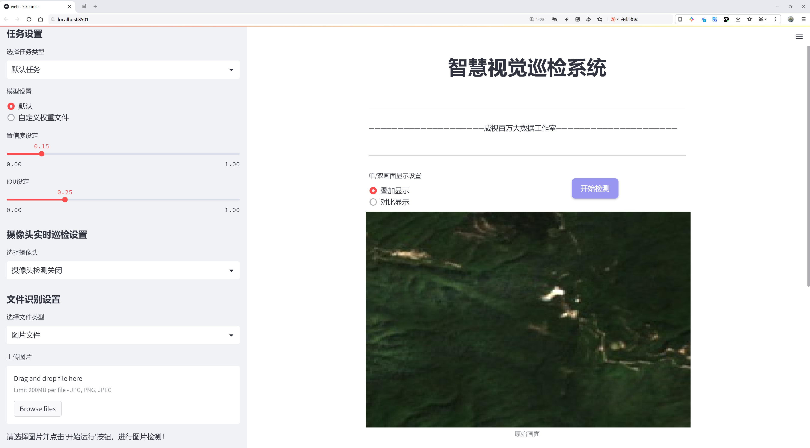
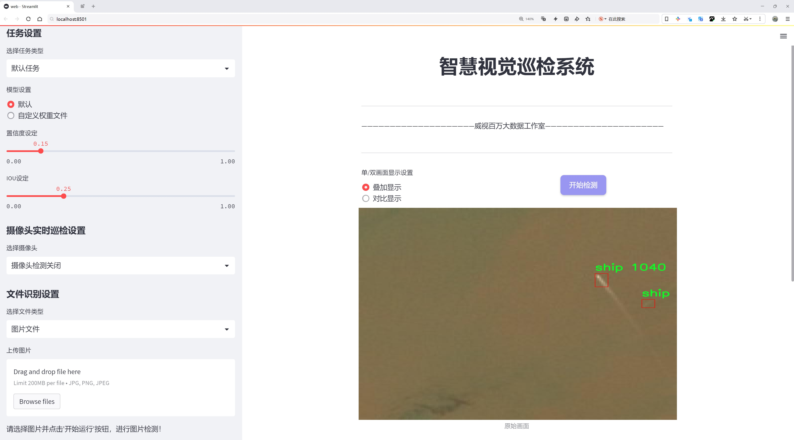
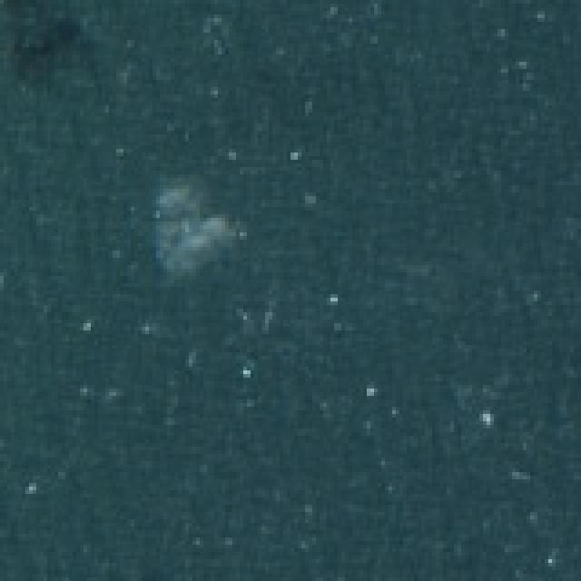
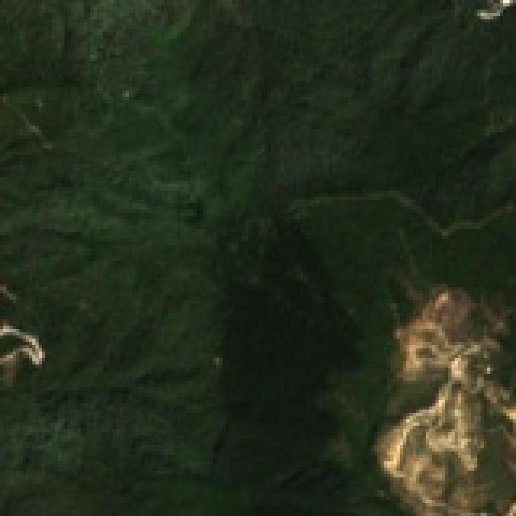
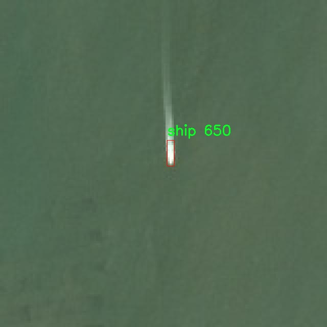
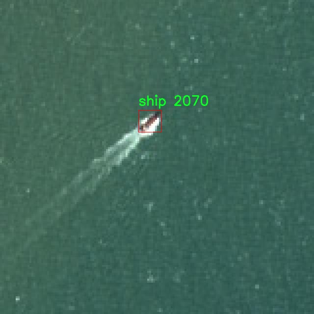

# 航拍船只检测检测系统源码分享
 # [一条龙教学YOLOV8标注好的数据集一键训练_70+全套改进创新点发刊_Web前端展示]

### 1.研究背景与意义

项目参考[AAAI Association for the Advancement of Artificial Intelligence](https://gitee.com/qunshansj/projects)

项目来源[AACV Association for the Advancement of Computer Vision](https://gitee.com/qunmasj/projects)

研究背景与意义

随着全球航运业的迅猛发展，海洋交通的安全性和高效性愈发受到重视。航拍技术的进步为海洋监测提供了新的手段，尤其是在船只检测与识别方面，具有重要的应用价值。传统的船只检测方法往往依赖于人工监测或基于规则的算法，这些方法不仅效率低下，而且在复杂环境下的准确性较低。因此，开发一种高效、准确的自动化船只检测系统显得尤为重要。

在这一背景下，基于深度学习的目标检测技术逐渐成为研究的热点。YOLO（You Only Look Once）系列模型因其高效的实时检测能力和良好的检测精度而受到广泛关注。YOLOv8作为该系列的最新版本，结合了多种先进的技术和算法，能够在保持高速度的同时，提升检测精度。然而，YOLOv8在特定场景下的表现仍有提升空间，尤其是在复杂的海洋环境中，船只的种类、形态和背景多样化，使得检测任务面临更大的挑战。因此，改进YOLOv8以适应航拍船只检测的需求，具有重要的研究意义。

本研究选取了“EastSeaShip 2”数据集，该数据集包含3867幅图像，涵盖了两类船只：普通船只和hxEG船只。这一数据集的多样性为模型的训练和测试提供了丰富的样本，有助于提高模型在实际应用中的泛化能力。通过对该数据集的深入分析，可以识别出不同类型船只的特征，从而为改进YOLOv8提供数据支持。此外，数据集中船只在不同光照、天气和海洋状态下的表现，能够帮助模型学习到更为鲁棒的特征，进一步提升检测精度。

改进YOLOv8的航拍船只检测系统，不仅可以提高船只检测的准确性和实时性，还能为海洋安全监测、环境保护和资源管理等领域提供技术支持。通过自动化的船只检测系统，相关部门能够及时获取海洋交通信息，快速响应潜在的安全隐患，进而提升海洋交通的安全性和效率。此外，该系统还可以为科研人员提供更为精确的数据支持，促进海洋科学研究的深入开展。

综上所述，基于改进YOLOv8的航拍船只检测系统的研究，不仅具有重要的理论价值，也具备广泛的实际应用前景。通过对现有技术的改进与创新，能够为海洋监测领域带来新的突破，推动相关技术的发展与应用，为保障海洋交通安全和促进可持续发展贡献力量。

### 2.图片演示






##### 注意：由于此博客编辑较早，上面“2.图片演示”和“3.视频演示”展示的系统图片或者视频可能为老版本，新版本在老版本的基础上升级如下：（实际效果以升级的新版本为准）

  （1）适配了YOLOV8的“目标检测”模型和“实例分割”模型，通过加载相应的权重（.pt）文件即可自适应加载模型。

  （2）支持“图片识别”、“视频识别”、“摄像头实时识别”三种识别模式。

  （3）支持“图片识别”、“视频识别”、“摄像头实时识别”三种识别结果保存导出，解决手动导出（容易卡顿出现爆内存）存在的问题，识别完自动保存结果并导出到tempDir中。

  （4）支持Web前端系统中的标题、背景图等自定义修改，后面提供修改教程。

  另外本项目提供训练的数据集和训练教程,暂不提供权重文件（best.pt）,需要您按照教程进行训练后实现图片演示和Web前端界面演示的效果。

### 3.视频演示

[3.1 视频演示](https://www.bilibili.com/video/BV1fu4mexENa/)

### 4.数据集信息展示

##### 4.1 本项目数据集详细数据（类别数＆类别名）

nc: 1
names: ['ship']


##### 4.2 本项目数据集信息介绍

数据集信息展示

在本研究中，我们采用了名为“EastSeaShip 2”的数据集，以改进YOLOv8的航拍船只检测系统。该数据集专注于航拍图像中的船只检测，旨在提升模型在复杂海洋环境中的识别能力和准确性。数据集的设计充分考虑了航拍图像的特点，包括光照变化、海浪干扰以及船只的多样性和复杂背景等因素，这些都是影响船只检测性能的重要因素。

“EastSeaShip 2”数据集的类别数量为1，专注于“ship”这一类别。这一选择不仅简化了数据集的构建过程，也使得模型在训练时能够集中精力于船只的特征提取与识别。数据集中的图像均为航拍视角，涵盖了不同类型、不同尺寸的船只，确保了数据的多样性和代表性。这种单一类别的设计使得模型能够更深入地学习船只的形态特征，从而在实际应用中实现更高的检测精度。

数据集的图像来源于多个航拍任务，涵盖了不同的海域和天气条件。这些图像不仅包括了在平静海面上航行的船只，还包含了在波涛汹涌的海面上行驶的船只，甚至在不同光照条件下的船只图像。这种多样化的场景设置使得“EastSeaShip 2”数据集能够有效模拟真实世界中的船只检测任务，提升了模型的泛化能力。

在数据集的标注方面，所有图像均经过专业人员的精确标注，确保每一艘船只都被准确框定。标注的质量直接影响到模型的训练效果，因此在构建数据集时，我们特别注重标注的准确性和一致性。此外，数据集还包括了一些难度较大的图像，例如船只与背景相似度较高的情况，这为模型的训练提供了更具挑战性的样本，有助于提升模型在复杂场景下的检测能力。

为了确保模型的训练效果，我们对“EastSeaShip 2”数据集进行了合理的划分，确保训练集、验证集和测试集的比例合理。这种划分方式不仅能够有效避免过拟合现象，还能在模型训练过程中提供持续的性能评估，确保模型在不同数据集上的表现一致性。

总之，“EastSeaShip 2”数据集为改进YOLOv8的航拍船只检测系统提供了坚实的基础。通过对该数据集的深入分析与应用，我们期望能够显著提升航拍船只检测的准确性和效率，为海洋监测、船只管理等实际应用提供更为可靠的技术支持。随着数据集的不断完善和模型的持续优化，我们相信未来的航拍船只检测系统将能够在更复杂的环境中表现出色，为海洋安全和环境保护贡献力量。










### 5.全套项目环境部署视频教程（零基础手把手教学）

[5.1 环境部署教程链接（零基础手把手教学）](https://www.ixigua.com/7404473917358506534?logTag=c807d0cbc21c0ef59de5)


[5.2 安装Python虚拟环境创建和依赖库安装视频教程链接（零基础手把手教学）](https://www.ixigua.com/7404474678003106304?logTag=1f1041108cd1f708b01a)

### 6.手把手YOLOV8训练视频教程（零基础小白有手就能学会）

[6.1 手把手YOLOV8训练视频教程（零基础小白有手就能学会）](https://www.ixigua.com/7404477157818401292?logTag=d31a2dfd1983c9668658)

### 7.70+种全套YOLOV8创新点代码加载调参视频教程（一键加载写好的改进模型的配置文件）

[7.1 70+种全套YOLOV8创新点代码加载调参视频教程（一键加载写好的改进模型的配置文件）](https://www.ixigua.com/7404478314661806627?logTag=29066f8288e3f4eea3a4)

### 8.70+种全套YOLOV8创新点原理讲解（非科班也可以轻松写刊发刊，V10版本正在科研待更新）

由于篇幅限制，每个创新点的具体原理讲解就不一一展开，具体见下列网址中的创新点对应子项目的技术原理博客网址【Blog】：


[8.1 70+种全套YOLOV8创新点原理讲解链接](https://gitee.com/qunmasj/good)

### 9.系统功能展示（检测对象为举例，实际内容以本项目数据集为准）

图9.1.系统支持检测结果表格显示

  图9.2.系统支持置信度和IOU阈值手动调节

  图9.3.系统支持自定义加载权重文件best.pt(需要你通过步骤5中训练获得)

  图9.4.系统支持摄像头实时识别

  图9.5.系统支持图片识别

  图9.6.系统支持视频识别

  图9.7.系统支持识别结果文件自动保存

  图9.8.系统支持Excel导出检测结果数据


### 10.原始YOLOV8算法原理

原始YOLOv8算法原理

YOLOv8算法作为目标检测领域的最新进展，继承并发展了YOLO系列模型的优良传统，结合了多种先进的设计理念，形成了一种高效、准确且灵活的目标检测框架。该算法的核心架构由输入层、主干网络、颈部网络和头部网络等主要组件构成，旨在实现对复杂场景中目标的快速识别与定位。

在YOLOv8的工作流程中，首先是输入层的图像预处理。输入图像会被缩放至指定的尺寸，以满足模型的输入要求。这一过程不仅确保了图像的统一性，还为后续的特征提取打下了基础。接下来，主干网络通过一系列卷积操作对图像进行下采样，提取出图像的深层特征。每个卷积层中都包含批归一化和SiLUR激活函数，这种设计旨在加速模型的收敛速度并提高特征的非线性表达能力。

YOLOv8的主干网络中引入了C2f模块，这一模块的设计灵感来源于YOLOv7中的E-ELAN结构。C2f模块通过跨层分支连接，增强了模型的梯度流动性，从而改善了检测结果的质量。通过这种结构，YOLOv8能够更有效地捕捉到图像中的重要特征，进而提升目标检测的准确性。此外，主干网络末尾的SPPFl块采用了三个最大池化层，旨在处理多尺度特征，以增强网络的特征抽象能力。这一设计使得YOLOv8在面对不同大小的目标时，能够保持较高的检测性能。

颈部网络则利用特征金字塔网络（FPN）和路径聚合网络（PAN）结构，进一步融合来自不同尺度特征图的信息。这一阶段的目标是将多层次的特征信息整合在一起，为后续的目标检测提供更加丰富的上下文信息。通过这种多尺度特征融合，YOLOv8能够更好地应对复杂场景中的目标检测任务，尤其是在目标大小差异较大的情况下，模型的表现尤为突出。

在头部网络中，YOLOv8采用了解耦的检测头，通过两个并行的卷积分支分别计算回归和类别的损失。这种设计不仅提高了模型的检测速度，还增强了其对目标类别的区分能力。解耦的检测头使得模型在进行目标定位和分类时，可以独立优化各自的损失函数，从而实现更高的检测精度。

值得一提的是，YOLOv8在目标检测过程中采用了无锚框（Anchor-Free）的检测方式。这一创新性设计使得模型可以直接预测目标的中心点和宽高比例，显著减少了Anchor框的数量。这种方式不仅提高了检测速度，还有效提升了检测的准确度，尤其是在复杂背景下，YOLOv8展现出了强大的鲁棒性。

总的来说，YOLOv8通过整合多种先进的技术和设计理念，构建了一个高效的目标检测框架。其主干网络、颈部网络和头部网络的协同工作，使得YOLOv8在特征提取和目标检测方面都表现出了优异的性能。随着YOLOv8的推出，目标检测领域的研究和应用将迎来新的机遇和挑战，尤其是在自动化和智能化的应用场景中，YOLOv8无疑将发挥重要的作用。

在实际应用中，YOLOv8的高精度和快速响应能力使其成为各种视觉识别任务的理想选择。例如，在农业领域，YOLOv8可以被用于苹果采摘的自动化系统，通过其强大的视觉识别能力，自动检测和定位苹果。这一应用不仅提高了采摘效率，还降低了人工成本。此外，结合蚁群算法进行路径规划，能够进一步优化采摘机器人的工作流程，使其在复杂环境中能够快速、准确地完成任务。

综上所述，YOLOv8算法不仅在理论上实现了多项技术突破，其在实际应用中的表现也为目标检测领域带来了新的冲击。随着技术的不断进步，YOLOv8将继续推动目标检测技术的发展，为各行各业的智能化转型提供强有力的支持。


### 11.项目核心源码讲解（再也不用担心看不懂代码逻辑）

#### 11.1 70+种YOLOv8算法改进源码大全和调试加载训练教程（非必要）\ultralytics\nn\extra_modules\ops_dcnv3\setup.py

以下是对代码的核心部分进行提炼和详细注释的结果：

```python
# --------------------------------------------------------
# InternImage
# Copyright (c) 2022 OpenGVLab
# Licensed under The MIT License [see LICENSE for details]
# --------------------------------------------------------

import os
import glob
import torch
from torch.utils.cpp_extension import CUDA_HOME, CppExtension, CUDAExtension
from setuptools import find_packages, setup

# 依赖库列表
requirements = ["torch", "torchvision"]

def get_extensions():
    # 获取当前文件的目录
    this_dir = os.path.dirname(os.path.abspath(__file__))
    # 定义扩展模块的源代码目录
    extensions_dir = os.path.join(this_dir, "src")

    # 查找主文件和CPU、CUDA源文件
    main_file = glob.glob(os.path.join(extensions_dir, "*.cpp"))
    source_cpu = glob.glob(os.path.join(extensions_dir, "cpu", "*.cpp"))
    source_cuda = glob.glob(os.path.join(extensions_dir, "cuda", "*.cu"))

    # 合并源文件列表
    sources = main_file + source_cpu
    extension = CppExtension  # 默认使用 CppExtension
    extra_compile_args = {"cxx": []}  # 额外的编译参数
    define_macros = []  # 定义的宏

    # 检查CUDA是否可用
    if torch.cuda.is_available() and CUDA_HOME is not None:
        extension = CUDAExtension  # 使用 CUDAExtension
        sources += source_cuda  # 添加CUDA源文件
        define_macros += [("WITH_CUDA", None)]  # 定义WITH_CUDA宏
        extra_compile_args["nvcc"] = []  # CUDA编译器的额外参数
    else:
        raise NotImplementedError('Cuda is not available')  # 抛出异常，表示CUDA不可用

    # 将源文件路径转换为绝对路径
    sources = [os.path.join(extensions_dir, s) for s in sources]
    include_dirs = [extensions_dir]  # 包含目录

    # 创建扩展模块
    ext_modules = [
        extension(
            "DCNv3",  # 扩展模块名称
            sources,  # 源文件列表
            include_dirs=include_dirs,  # 包含目录
            define_macros=define_macros,  # 定义的宏
            extra_compile_args=extra_compile_args,  # 额外编译参数
        )
    ]
    return ext_modules  # 返回扩展模块列表

# 设置包信息
setup(
    name="DCNv3",  # 包名称
    version="1.1",  # 版本号
    author="InternImage",  # 作者
    url="https://github.com/OpenGVLab/InternImage",  # 项目链接
    description="PyTorch Wrapper for CUDA Functions of DCNv3",  # 描述
    packages=find_packages(exclude=("configs", "tests")),  # 查找包，排除configs和tests目录
    ext_modules=get_extensions(),  # 获取扩展模块
    cmdclass={"build_ext": torch.utils.cpp_extension.BuildExtension},  # 自定义构建命令
)
```

### 代码分析
1. **导入必要的库**：代码首先导入了必要的库，包括操作系统库、文件查找库、PyTorch库和setuptools库。
  
2. **获取扩展模块**：`get_extensions` 函数负责查找源文件并根据CUDA的可用性决定使用CPU或CUDA扩展。它构建了一个包含所有源文件的列表，并设置了相应的编译参数。

3. **条件编译**：根据CUDA的可用性，决定使用 `CppExtension` 还是 `CUDAExtension`，并添加相应的源文件和宏定义。

4. **设置包信息**：`setup` 函数用于定义包的基本信息，包括名称、版本、作者、描述、需要排除的包以及扩展模块。

### 总结
这段代码主要用于设置一个Python包，该包包含用于PyTorch的CUDA扩展。通过条件判断，代码确保在CUDA可用的情况下才会编译CUDA源文件，从而提高了代码的可移植性和灵活性。

这个文件是一个 Python 的 `setup.py` 脚本，用于配置和安装一个名为 "DCNv3" 的扩展模块。该模块是基于 PyTorch 的 CUDA 函数的封装，主要用于深度学习中的某些特定操作。以下是对代码的逐行分析和说明。

首先，文件头部包含了一些版权信息和许可证声明，表明该代码由 OpenGVLab 开发，并遵循 MIT 许可证。

接下来，代码导入了一些必要的库，包括 `os` 和 `glob` 用于文件路径操作，`torch` 用于深度学习框架的功能，`torch.utils.cpp_extension` 中的 `CUDA_HOME`、`CppExtension` 和 `CUDAExtension` 用于编译 C++ 和 CUDA 扩展模块，`setuptools` 用于设置和安装 Python 包。

`requirements` 列表定义了该模块的依赖项，包括 `torch` 和 `torchvision`。

`get_extensions` 函数用于获取要编译的扩展模块。首先，它获取当前文件所在目录的路径，并构建源代码目录的路径。然后，使用 `glob` 模块查找该目录下的所有 C++ 源文件和 CUDA 源文件。

在这个函数中，首先会查找主文件和 CPU 相关的源文件，并将它们存储在 `sources` 列表中。接着，代码检查是否可以使用 CUDA。如果可以，扩展类型将设置为 `CUDAExtension`，并将 CUDA 源文件添加到 `sources` 列表中，同时定义一个宏 `WITH_CUDA`。如果 CUDA 不可用，则抛出一个 `NotImplementedError`。

接下来，`sources` 列表中的文件路径会被整理为绝对路径，并设置包含目录。然后，创建一个扩展模块的列表 `ext_modules`，其中包含了扩展的名称、源文件、包含目录、定义的宏和额外的编译参数。

最后，使用 `setup` 函数来配置包的基本信息，包括包名、版本、作者、项目网址、描述、要包含的包（排除某些目录），以及通过 `get_extensions` 函数获取的扩展模块。`cmdclass` 参数指定了构建扩展时使用的命令类。

总体来说，这个 `setup.py` 文件的主要功能是为 DCNv3 模块的编译和安装提供必要的配置，确保在适当的环境中（即安装了 CUDA 的情况下）能够顺利构建和使用该模块。

#### 11.2 ui.py

```python
import sys
import subprocess

def run_script(script_path):
    """
    使用当前 Python 环境运行指定的脚本。

    Args:
        script_path (str): 要运行的脚本路径

    Returns:
        None
    """
    # 获取当前 Python 解释器的路径
    python_path = sys.executable

    # 构建运行命令
    command = f'"{python_path}" -m streamlit run "{script_path}"'

    # 执行命令
    result = subprocess.run(command, shell=True)
    if result.returncode != 0:
        print("脚本运行出错。")


# 实例化并运行应用
if __name__ == "__main__":
    # 指定您的脚本路径
    script_path = "web.py"  # 这里直接指定脚本路径

    # 运行脚本
    run_script(script_path)  # 调用函数运行指定的脚本
```

### 代码注释说明：

1. **导入模块**：
   - `import sys`：导入系统相关的模块，用于获取当前 Python 解释器的路径。
   - `import subprocess`：导入子进程模块，用于在 Python 中执行外部命令。

2. **定义函数 `run_script`**：
   - 该函数接收一个参数 `script_path`，表示要运行的 Python 脚本的路径。
   - 函数内部首先获取当前 Python 解释器的路径，然后构建一个命令字符串，用于运行指定的脚本。

3. **构建命令**：
   - 使用格式化字符串构建命令，命令格式为：`python -m streamlit run script_path`，其中 `script_path` 是传入的脚本路径。

4. **执行命令**：
   - 使用 `subprocess.run` 方法执行构建的命令，并将 `shell` 参数设置为 `True`，允许在 shell 中执行命令。
   - 检查命令执行的返回码，如果返回码不为 0，表示脚本运行出错，打印错误信息。

5. **主程序入口**：
   - 使用 `if __name__ == "__main__":` 确保只有在直接运行该脚本时才会执行以下代码。
   - 指定要运行的脚本路径为 `web.py`。
   - 调用 `run_script` 函数，传入脚本路径以运行该脚本。

这个程序文件名为 `ui.py`，其主要功能是使用当前的 Python 环境来运行一个指定的脚本，具体是通过 Streamlit 框架来启动一个 Web 应用。

程序首先导入了必要的模块，包括 `sys`、`os` 和 `subprocess`，这些模块提供了与系统交互的功能。接着，从 `QtFusion.path` 模块中导入了 `abs_path` 函数，用于获取脚本的绝对路径。

在 `run_script` 函数中，程序接收一个参数 `script_path`，这个参数是要运行的脚本的路径。函数内部首先获取当前 Python 解释器的路径，使用 `sys.executable` 来实现。然后，构建一个命令字符串，该命令使用当前的 Python 解释器和 Streamlit 模块来运行指定的脚本。具体的命令格式为 `"{python_path}" -m streamlit run "{script_path}"`。

接下来，程序使用 `subprocess.run` 方法来执行这个命令。`shell=True` 参数允许在 shell 中执行命令。执行完命令后，程序检查返回码 `result.returncode`，如果返回码不为 0，表示脚本运行出错，程序会打印出“脚本运行出错。”的提示信息。

在文件的最后部分，使用 `if __name__ == "__main__":` 语句来确保只有在直接运行该脚本时才会执行后面的代码。在这里，程序指定了要运行的脚本路径，调用 `abs_path` 函数获取 `web.py` 的绝对路径，并将其传递给 `run_script` 函数以启动该脚本。

总的来说，这个程序的主要作用是方便地通过当前 Python 环境运行一个 Streamlit 应用脚本，并处理可能出现的错误。

#### 11.3 70+种YOLOv8算法改进源码大全和调试加载训练教程（非必要）\ultralytics\trackers\byte_tracker.py

以下是代码中最核心的部分，并附上详细的中文注释：

```python
import numpy as np
from .basetrack import BaseTrack, TrackState
from .utils import matching
from .utils.kalman_filter import KalmanFilterXYAH

class STrack(BaseTrack):
    """
    单目标跟踪表示，使用卡尔曼滤波进行状态估计。

    该类负责存储与单个跟踪对象相关的所有信息，并基于卡尔曼滤波进行状态更新和预测。
    """

    shared_kalman = KalmanFilterXYAH()  # 所有STrack实例共享的卡尔曼滤波器

    def __init__(self, tlwh, score, cls):
        """初始化新的STrack实例。"""
        # 将输入的边界框格式转换为tlwh格式（左上角坐标，宽度，高度）
        self._tlwh = np.asarray(self.tlbr_to_tlwh(tlwh[:-1]), dtype=np.float32)
        self.kalman_filter = None  # 该对象跟踪的卡尔曼滤波器实例
        self.mean, self.covariance = None, None  # 状态均值和协方差
        self.is_activated = False  # 跟踪是否被激活的标志

        self.score = score  # 跟踪的置信度分数
        self.tracklet_len = 0  # 跟踪片段的长度
        self.cls = cls  # 对象的类别标签
        self.idx = tlwh[-1]  # 对象的索引

    def predict(self):
        """使用卡尔曼滤波器预测对象的下一个状态。"""
        mean_state = self.mean.copy()  # 复制当前均值状态
        if self.state != TrackState.Tracked:  # 如果状态不是跟踪状态
            mean_state[7] = 0  # 将速度设为0
        # 使用卡尔曼滤波器进行预测
        self.mean, self.covariance = self.kalman_filter.predict(mean_state, self.covariance)

    def activate(self, kalman_filter, frame_id):
        """激活新的跟踪片段。"""
        self.kalman_filter = kalman_filter  # 设置卡尔曼滤波器
        self.track_id = self.next_id()  # 获取下一个跟踪ID
        # 初始化状态均值和协方差
        self.mean, self.covariance = self.kalman_filter.initiate(self.convert_coords(self._tlwh))

        self.tracklet_len = 0  # 重置跟踪片段长度
        self.state = TrackState.Tracked  # 设置状态为跟踪状态
        if frame_id == 1:
            self.is_activated = True  # 在第一帧激活跟踪
        self.frame_id = frame_id  # 设置当前帧ID
        self.start_frame = frame_id  # 设置开始帧ID

    def update(self, new_track, frame_id):
        """
        更新匹配跟踪的状态。

        参数:
            new_track (STrack): 包含更新信息的新跟踪对象。
            frame_id (int): 当前帧的ID。
        """
        self.frame_id = frame_id  # 更新当前帧ID
        self.tracklet_len += 1  # 增加跟踪片段长度

        new_tlwh = new_track.tlwh  # 获取新的边界框
        # 使用卡尔曼滤波器更新状态均值和协方差
        self.mean, self.covariance = self.kalman_filter.update(self.mean, self.covariance,
                                                               self.convert_coords(new_tlwh))
        self.state = TrackState.Tracked  # 设置状态为跟踪状态
        self.is_activated = True  # 激活跟踪

        self.score = new_track.score  # 更新置信度分数
        self.cls = new_track.cls  # 更新类别标签
        self.idx = new_track.idx  # 更新索引

    @property
    def tlwh(self):
        """获取当前的边界框位置（左上角x，左上角y，宽度，高度）。"""
        if self.mean is None:
            return self._tlwh.copy()  # 如果均值为None，返回初始的tlwh
        ret = self.mean[:4].copy()  # 复制均值的前四个元素
        ret[2] *= ret[3]  # 宽度 = 宽度 * 高度
        ret[:2] -= ret[2:] / 2  # 计算左上角坐标
        return ret

    @staticmethod
    def tlwh_to_xyah(tlwh):
        """将边界框转换为格式（中心x，中心y，宽高比，高度）。"""
        ret = np.asarray(tlwh).copy()  # 复制tlwh
        ret[:2] += ret[2:] / 2  # 计算中心坐标
        ret[2] /= ret[3]  # 计算宽高比
        return ret
```

### 代码核心部分说明
1. **STrack类**：该类是单目标跟踪的核心，使用卡尔曼滤波器进行状态估计和更新。它存储了跟踪对象的所有信息，并提供了多种方法来预测和更新状态。

2. **卡尔曼滤波器**：`shared_kalman`是一个共享的卡尔曼滤波器实例，用于所有STrack对象的状态预测。

3. **状态管理**：`activate`和`update`方法用于激活新的跟踪片段和更新现有的跟踪状态。

4. **边界框转换**：`tlwh`和`tlwh_to_xyah`方法用于在不同的边界框表示之间进行转换，确保跟踪信息的准确性。

这些核心部分是实现目标跟踪的基础，确保了跟踪的准确性和实时性。

该程序文件实现了一个基于YOLOv8的对象跟踪算法，主要包含两个类：`STrack`和`BYTETracker`。`STrack`类用于表示单个对象的跟踪状态，利用卡尔曼滤波进行状态估计和更新。该类的主要属性包括跟踪框的坐标、卡尔曼滤波器实例、状态均值和协方差、跟踪状态标志、置信度分数、跟踪长度、类别标签和对象索引等。`STrack`类提供了一系列方法来进行状态预测、更新和坐标转换。

`BYTETracker`类则负责管理多个对象的跟踪，包括初始化、更新和维护跟踪状态。它维护了三种状态的跟踪列表：成功激活的跟踪、丢失的跟踪和已移除的跟踪。该类的核心方法是`update`，用于处理新的检测结果，更新跟踪状态，并通过卡尔曼滤波预测对象的新位置。`BYTETracker`还实现了多种辅助方法，例如计算跟踪与检测之间的距离、合并和过滤跟踪列表等。

在`update`方法中，首先根据检测结果更新当前帧的ID，并对检测结果进行筛选。接着，利用卡尔曼滤波对当前跟踪对象的位置进行预测，并进行数据关联，匹配检测结果与现有跟踪。对于未确认的跟踪，算法会尝试将其与低置信度的检测结果进行关联。最后，算法会初始化新的跟踪并更新状态，确保跟踪列表的准确性和有效性。

总体而言，该文件实现了一个高效的对象跟踪系统，结合了YOLOv8的检测能力和卡尔曼滤波的预测能力，适用于实时视频分析等应用场景。

#### 11.4 70+种YOLOv8算法改进源码大全和调试加载训练教程（非必要）\ultralytics\models\sam\model.py

以下是经过简化和注释的核心代码部分：

```python
from pathlib import Path
from ultralytics.engine.model import Model
from .build import build_sam
from .predict import Predictor

class SAM(Model):
    """
    SAM (Segment Anything Model) 接口类。

    SAM 旨在实现可提示的实时图像分割。可以使用多种提示方式，如边界框、点或标签。
    该模型具有零-shot 性能，并在 SA-1B 数据集上进行了训练。
    """

    def __init__(self, model='sam_b.pt') -> None:
        """
        使用预训练模型文件初始化 SAM 模型。

        参数:
            model (str): 预训练 SAM 模型文件的路径，文件应具有 .pt 或 .pth 扩展名。

        异常:
            NotImplementedError: 如果模型文件扩展名不是 .pt 或 .pth。
        """
        # 检查模型文件扩展名是否有效
        if model and Path(model).suffix not in ('.pt', '.pth'):
            raise NotImplementedError('SAM 预测需要预训练的 *.pt 或 *.pth 模型。')
        super().__init__(model=model, task='segment')  # 调用父类初始化

    def _load(self, weights: str, task=None):
        """
        加载指定的权重到 SAM 模型中。

        参数:
            weights (str): 权重文件的路径。
            task (str, optional): 任务名称，默认为 None。
        """
        self.model = build_sam(weights)  # 构建 SAM 模型

    def predict(self, source, stream=False, bboxes=None, points=None, labels=None, **kwargs):
        """
        对给定的图像或视频源执行分割预测。

        参数:
            source (str): 图像或视频文件的路径，或 PIL.Image 对象，或 numpy.ndarray 对象。
            stream (bool, optional): 如果为 True，则启用实时流。默认为 False。
            bboxes (list, optional): 提示分割的边界框坐标列表。默认为 None。
            points (list, optional): 提示分割的点列表。默认为 None。
            labels (list, optional): 提示分割的标签列表。默认为 None。

        返回:
            (list): 模型预测结果。
        """
        # 设置默认参数
        overrides = dict(conf=0.25, task='segment', mode='predict', imgsz=1024)
        kwargs.update(overrides)  # 更新参数
        prompts = dict(bboxes=bboxes, points=points, labels=labels)  # 提示信息
        return super().predict(source, stream, prompts=prompts, **kwargs)  # 调用父类的预测方法

    def __call__(self, source=None, stream=False, bboxes=None, points=None, labels=None, **kwargs):
        """
        'predict' 方法的别名。

        参数和返回值与 predict 方法相同。
        """
        return self.predict(source, stream, bboxes, points, labels, **kwargs)

    def info(self, detailed=False, verbose=True):
        """
        记录有关 SAM 模型的信息。

        参数:
            detailed (bool, optional): 如果为 True，则显示模型的详细信息。默认为 False。
            verbose (bool, optional): 如果为 True，则在控制台显示信息。默认为 True。

        返回:
            (tuple): 包含模型信息的元组。
        """
        return model_info(self.model, detailed=detailed, verbose=verbose)  # 获取模型信息

    @property
    def task_map(self):
        """
        提供从 'segment' 任务到其对应 'Predictor' 的映射。

        返回:
            (dict): 将 'segment' 任务映射到其对应 'Predictor' 的字典。
        """
        return {'segment': {'predictor': Predictor}}  # 返回任务映射
```

### 代码注释说明
1. **类定义**：`SAM` 类是一个用于图像分割的模型接口，继承自 `Model` 类。
2. **初始化方法**：`__init__` 方法用于初始化模型，检查模型文件的有效性。
3. **加载权重**：`_load` 方法用于加载模型权重。
4. **预测方法**：`predict` 方法执行图像分割预测，支持多种输入格式和提示方式。
5. **调用方法**：`__call__` 方法使得 `SAM` 实例可以像函数一样被调用，实际上调用的是 `predict` 方法。
6. **信息获取**：`info` 方法用于获取模型的相关信息。
7. **任务映射**：`task_map` 属性提供了任务与预测器之间的映射关系。

该程序文件是Ultralytics YOLO项目中的一个模块，主要用于实现Segment Anything Model（SAM）的接口。SAM模型专门设计用于实时图像分割任务，具有很高的灵活性，能够通过不同的提示（如边界框、点或标签）进行分割，并且具备零-shot性能，意味着它可以在没有先前知识的情况下适应新的图像分布和任务。该模型是在SA-1B数据集上训练的。

文件中首先导入了一些必要的库和模块，包括Path类用于处理文件路径，Model类用于继承YOLO模型的基本功能，以及其他一些辅助功能模块。接着定义了一个名为SAM的类，继承自Model类。

在SAM类的构造函数中，初始化时需要传入一个预训练模型文件的路径，该文件应为.pt或.pth格式。如果传入的文件格式不符合要求，将抛出NotImplementedError异常。构造函数调用了父类的初始化方法，并指定任务为“segment”。

_load方法用于加载指定的权重文件到SAM模型中。该方法接受权重文件的路径和任务名称作为参数。

predict方法是该类的核心功能之一，负责对给定的图像或视频源进行分割预测。该方法接受多个参数，包括源文件路径、是否启用实时流、边界框、点和标签等提示信息。方法内部设置了一些默认参数，并将提示信息封装成字典，最后调用父类的predict方法进行预测。

__call__方法是predict方法的别名，允许用户以更简洁的方式调用预测功能。

info方法用于记录SAM模型的信息，可以选择是否显示详细信息和是否在控制台输出。

最后，task_map属性提供了一个字典，将“segment”任务映射到其对应的Predictor，方便后续的任务处理。

总体而言，该文件为SAM模型提供了一个结构化的接口，使得用户能够方便地进行图像分割任务，并利用该模型的多种功能。

#### 11.5 code\ultralytics\engine\exporter.py

以下是经过简化并添加详细中文注释的代码，保留了最核心的部分：

```python
import json
import os
import shutil
import subprocess
import time
import warnings
from copy import deepcopy
from datetime import datetime
from pathlib import Path

import numpy as np
import torch

from ultralytics.cfg import get_cfg
from ultralytics.utils import (
    LOGGER,
    __version__,
    callbacks,
    select_device,
    check_imgsz,
)

class Exporter:
    """
    模型导出类，用于将YOLOv8模型导出为不同格式。
    """

    def __init__(self, cfg='default_cfg.yaml', overrides=None, _callbacks=None):
        """
        初始化Exporter类。

        参数:
            cfg (str): 配置文件路径，默认为'default_cfg.yaml'。
            overrides (dict): 配置覆盖，默认为None。
            _callbacks (dict): 回调函数字典，默认为None。
        """
        self.args = get_cfg(cfg, overrides)  # 获取配置
        self.callbacks = _callbacks or callbacks.get_default_callbacks()  # 获取回调函数
        callbacks.add_integration_callbacks(self)  # 添加集成回调

    def __call__(self, model=None):
        """执行导出并返回导出文件/目录列表。"""
        self.run_callbacks("on_export_start")  # 运行导出开始的回调
        t = time.time()  # 记录开始时间
        fmt = self.args.format.lower()  # 获取导出格式并转为小写

        # 选择设备
        self.device = select_device("cpu" if self.args.device is None else self.args.device)

        # 检查模型
        model = deepcopy(model).to(self.device)  # 深拷贝模型并转移到指定设备
        model.eval()  # 设置模型为评估模式
        model.float()  # 转为浮点数模式

        # 生成输入张量
        im = torch.zeros(self.args.batch, 3, *self.args.imgsz).to(self.device)

        # 进行导出
        f = self.export_onnx(model, im)  # 导出为ONNX格式

        # 完成导出
        self.run_callbacks("on_export_end")  # 运行导出结束的回调
        return f  # 返回导出文件路径

    def export_onnx(self, model, im):
        """导出为ONNX格式。"""
        f = str(Path("model.onnx"))  # 定义导出文件名
        torch.onnx.export(
            model.cpu(),  # 将模型转移到CPU
            im.cpu(),  # 将输入转移到CPU
            f,  # 导出文件路径
            input_names=["images"],  # 输入名称
            output_names=["output0"],  # 输出名称
            dynamic_axes={"images": {0: "batch", 2: "height", 3: "width"}}  # 动态轴
        )
        return f  # 返回导出文件路径

    def run_callbacks(self, event: str):
        """执行给定事件的所有回调。"""
        for callback in self.callbacks.get(event, []):
            callback(self)  # 执行回调

# 示例使用
# exporter = Exporter(cfg='path/to/config.yaml')
# exported_file = exporter(model)  # 导出模型
```

### 代码注释说明
1. **导入模块**：导入所需的库和模块，包括基本的Python库和YOLOv8相关的模块。
2. **Exporter类**：定义了一个用于导出YOLOv8模型的类，包含初始化和导出方法。
3. **初始化方法**：获取配置并设置回调函数。
4. **调用方法**：执行导出过程，选择设备，检查模型，并调用导出方法。
5. **导出ONNX方法**：将模型导出为ONNX格式，指定输入和输出名称。
6. **回调方法**：执行在导出过程中需要调用的回调函数。

以上代码是核心部分，其他格式的导出和复杂的逻辑被省略，以保持简洁性。

这个程序文件是一个用于将YOLOv8模型导出为多种格式的工具，主要用于深度学习模型的转换和部署。文件的开头部分提供了支持的导出格式，包括PyTorch、ONNX、TensorFlow等，并列出了相应的命令行和Python API的使用示例。

程序中定义了多个函数和类，其中最重要的是`Exporter`类。这个类负责处理模型的导出过程，包括初始化配置、检查导出格式的有效性、准备模型和输入数据、执行导出操作等。它还支持通过回调函数在导出过程中的不同阶段执行特定操作。

在`Exporter`类的构造函数中，首先会读取配置文件并进行初始化。接着，在调用`__call__`方法时，会根据用户指定的格式进行相应的导出。该方法会进行一系列的检查，确保模型和输入数据的正确性，并根据需要对模型进行预处理。

程序中还定义了多个导出方法，例如`export_torchscript`、`export_onnx`、`export_saved_model`等，每个方法负责将模型导出为特定格式。在导出过程中，程序会记录导出时间、文件大小等信息，并在成功或失败时输出相应的日志信息。

此外，程序还提供了一些辅助函数，例如`gd_outputs`用于获取TensorFlow GraphDef模型的输出节点名称，`try_export`是一个装饰器，用于捕获导出过程中的异常并记录日志。

整体来看，这个程序文件实现了YOLOv8模型的多格式导出功能，便于用户根据不同的需求将模型转换为适合的格式进行部署和推理。通过使用这个工具，用户可以方便地将训练好的YOLOv8模型导出为各种深度学习框架所需的格式，从而提高模型的可用性和灵活性。

#### 11.6 train.py

以下是经过简化并添加详细中文注释的核心代码部分：

```python
import random
import numpy as np
import torch.nn as nn
from ultralytics.data import build_dataloader, build_yolo_dataset
from ultralytics.engine.trainer import BaseTrainer
from ultralytics.models import yolo
from ultralytics.nn.tasks import DetectionModel
from ultralytics.utils import LOGGER, RANK
from ultralytics.utils.torch_utils import de_parallel, torch_distributed_zero_first

class DetectionTrainer(BaseTrainer):
    """
    基于检测模型的训练类，继承自BaseTrainer类。
    """

    def build_dataset(self, img_path, mode="train", batch=None):
        """
        构建YOLO数据集。

        参数:
            img_path (str): 包含图像的文件夹路径。
            mode (str): 模式，可以是'train'或'val'，用户可以为每种模式自定义不同的数据增强。
            batch (int, optional): 批次大小，适用于'rect'模式。默认为None。
        """
        gs = max(int(de_parallel(self.model).stride.max() if self.model else 0), 32)  # 获取模型的最大步幅
        return build_yolo_dataset(self.args, img_path, batch, self.data, mode=mode, rect=mode == "val", stride=gs)

    def get_dataloader(self, dataset_path, batch_size=16, rank=0, mode="train"):
        """构建并返回数据加载器。"""
        assert mode in ["train", "val"]  # 确保模式合法
        with torch_distributed_zero_first(rank):  # 在分布式环境中，确保数据集只初始化一次
            dataset = self.build_dataset(dataset_path, mode, batch_size)  # 构建数据集
        shuffle = mode == "train"  # 训练模式下打乱数据
        workers = self.args.workers if mode == "train" else self.args.workers * 2  # 设置工作线程数
        return build_dataloader(dataset, batch_size, workers, shuffle, rank)  # 返回数据加载器

    def preprocess_batch(self, batch):
        """对图像批次进行预处理，包括缩放和转换为浮点数。"""
        batch["img"] = batch["img"].to(self.device, non_blocking=True).float() / 255  # 将图像转换为浮点数并归一化
        if self.args.multi_scale:  # 如果启用多尺度
            imgs = batch["img"]
            sz = (
                random.randrange(self.args.imgsz * 0.5, self.args.imgsz * 1.5 + self.stride)
                // self.stride
                * self.stride
            )  # 随机选择一个新的尺寸
            sf = sz / max(imgs.shape[2:])  # 计算缩放因子
            if sf != 1:  # 如果缩放因子不为1
                ns = [
                    math.ceil(x * sf / self.stride) * self.stride for x in imgs.shape[2:]
                ]  # 计算新的形状
                imgs = nn.functional.interpolate(imgs, size=ns, mode="bilinear", align_corners=False)  # 进行插值
            batch["img"] = imgs  # 更新批次图像
        return batch

    def get_model(self, cfg=None, weights=None, verbose=True):
        """返回YOLO检测模型。"""
        model = DetectionModel(cfg, nc=self.data["nc"], verbose=verbose and RANK == -1)  # 创建检测模型
        if weights:
            model.load(weights)  # 加载权重
        return model

    def plot_training_samples(self, batch, ni):
        """绘制带有注释的训练样本。"""
        plot_images(
            images=batch["img"],
            batch_idx=batch["batch_idx"],
            cls=batch["cls"].squeeze(-1),
            bboxes=batch["bboxes"],
            paths=batch["im_file"],
            fname=self.save_dir / f"train_batch{ni}.jpg",
            on_plot=self.on_plot,
        )

    def plot_metrics(self):
        """从CSV文件中绘制指标。"""
        plot_results(file=self.csv, on_plot=self.on_plot)  # 保存结果图
```

### 代码核心部分说明：
1. **数据集构建** (`build_dataset`): 负责根据输入路径和模式构建YOLO数据集，支持训练和验证模式。
2. **数据加载器** (`get_dataloader`): 构建并返回一个数据加载器，用于批量加载数据。
3. **批次预处理** (`preprocess_batch`): 对图像批次进行预处理，包括归一化和可能的缩放。
4. **模型获取** (`get_model`): 创建并返回一个YOLO检测模型，可以选择加载预训练权重。
5. **绘制训练样本** (`plot_training_samples`): 将训练样本及其注释绘制为图像。
6. **绘制指标** (`plot_metrics`): 从CSV文件中读取并绘制训练过程中的指标。

这个程序文件 `train.py` 是一个用于训练 YOLO（You Only Look Once）目标检测模型的脚本，继承自 `BaseTrainer` 类。程序的主要功能是构建数据集、创建数据加载器、预处理图像、设置模型属性、获取模型、进行验证、记录损失、显示训练进度以及绘制训练样本和指标。

首先，程序导入了必要的库和模块，包括数学运算、随机数生成、深度学习相关的 PyTorch 模块以及 Ultralytics 提供的工具和模型。接着，定义了 `DetectionTrainer` 类，这个类专门用于处理目标检测任务。

在 `build_dataset` 方法中，程序根据给定的图像路径和模式（训练或验证）构建 YOLO 数据集。该方法使用 `build_yolo_dataset` 函数来创建数据集，并根据模型的步幅（stride）进行适当的调整。

`get_dataloader` 方法用于构建并返回数据加载器。它会根据训练或验证模式设置数据集的打乱方式，并根据模式选择工作线程的数量。使用 `torch_distributed_zero_first` 确保在分布式训练时，数据集只初始化一次。

`preprocess_batch` 方法负责对图像批次进行预处理，包括将图像缩放到合适的大小并转换为浮点数格式。它还支持多尺度训练，通过随机选择图像大小来增强模型的鲁棒性。

`set_model_attributes` 方法用于设置模型的属性，包括类别数量和类别名称等。这样可以确保模型在训练时能够正确处理不同的类别。

`get_model` 方法返回一个 YOLO 检测模型实例，并在提供权重时加载这些权重。`get_validator` 方法则返回一个用于验证模型性能的验证器。

在 `label_loss_items` 方法中，程序返回一个包含训练损失项的字典，方便在训练过程中进行监控。`progress_string` 方法生成一个格式化的字符串，用于显示训练进度，包括当前的轮次、GPU 内存使用情况、损失值、实例数量和图像大小。

`plot_training_samples` 方法用于绘制训练样本及其标注，帮助可视化训练数据的质量。最后，`plot_metrics` 和 `plot_training_labels` 方法用于绘制训练过程中的指标和标签，分别从 CSV 文件中读取数据并生成可视化图表。

总体而言，这个程序文件实现了 YOLO 模型的训练流程，包括数据准备、模型构建、训练过程监控和结果可视化等功能，是一个完整的目标检测训练框架。

### 12.系统整体结构（节选）

### 整体功能和构架概括

该项目是一个基于YOLOv8的目标检测和分割框架，提供了多种算法改进和工具，旨在为用户提供灵活的模型训练、导出和推理功能。项目的核心功能包括：

1. **模型训练**：通过 `train.py` 文件，用户可以方便地训练YOLOv8模型，支持多种数据集和训练配置。
2. **模型导出**：`exporter.py` 文件提供了将训练好的模型导出为不同格式（如ONNX、TensorFlow等）的功能，便于模型的部署和应用。
3. **对象跟踪**：`byte_tracker.py` 文件实现了基于YOLOv8的对象跟踪算法，能够实时跟踪视频中的目标。
4. **图像分割**：`model.py` 文件实现了Segment Anything Model（SAM），用于高效的图像分割任务。
5. **用户界面**：`ui.py` 文件提供了一个简单的用户界面，方便用户启动和运行模型。
6. **额外模块**：`setup.py` 和其他模块文件（如 `attention.py`、`ops.py` 等）提供了模型的额外功能和优化，增强了模型的性能和灵活性。

### 文件功能整理表

| 文件路径                                                                                      | 功能描述                                                     |
|-----------------------------------------------------------------------------------------------|------------------------------------------------------------|
| `ultralytics/nn/extra_modules/ops_dcnv3/setup.py`                                           | 配置和安装DCNv3扩展模块，用于深度学习中的特定操作。       |
| `ui.py`                                                                                      | 提供用户界面，允许用户通过Streamlit运行指定的脚本。       |
| `ultralytics/trackers/byte_tracker.py`                                                       | 实现基于YOLOv8的对象跟踪算法，支持实时目标跟踪。           |
| `ultralytics/models/sam/model.py`                                                            | 实现Segment Anything Model（SAM），用于图像分割任务。      |
| `ultralytics/engine/exporter.py`                                                             | 提供将YOLOv8模型导出为多种格式的功能，便于模型部署。      |
| `train.py`                                                                                   | 训练YOLOv8模型，处理数据集、模型构建和训练过程监控。      |
| `ultralytics/data/__init__.py`                                                               | 初始化数据模块，可能包含数据集加载和处理的相关功能。      |
| `ultralytics/utils/metrics.py`                                                                | 提供评估指标计算功能，用于监控模型性能。                   |
| `ultralytics/nn/extra_modules/orepa.py`                                                     | 实现OREPA模块，可能用于模型的特定优化或增强。             |
| `ultralytics/models/yolo/pose/val.py`                                                       | 进行YOLO模型的验证，可能涉及姿态估计任务。                 |
| `ultralytics/utils/ops.py`                                                                   | 提供各种操作和工具函数，支持模型的构建和训练。             |
| `ultralytics/nn/modules/transformer.py`                                                     | 实现Transformer模块，可能用于模型的特定结构或功能。       |
| `ultralytics/nn/extra_modules/attention.py`                                                 | 实现注意力机制模块，增强模型的特征提取能力。               |

以上表格总结了项目中各个文件的主要功能，帮助用户理解整个项目的结构和用途。

注意：由于此博客编辑较早，上面“11.项目核心源码讲解（再也不用担心看不懂代码逻辑）”中部分代码可能会优化升级，仅供参考学习，完整“训练源码”、“Web前端界面”和“70+种创新点源码”以“13.完整训练+Web前端界面+70+种创新点源码、数据集获取”的内容为准。

### 13.完整训练+Web前端界面+70+种创新点源码、数据集获取


# [下载链接：https://mbd.pub/o/bread/ZpuVmZpu](https://mbd.pub/o/bread/ZpuVmZpu)